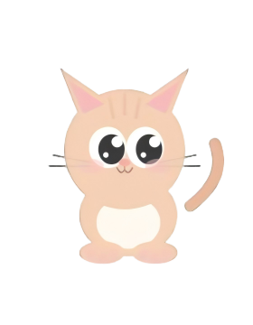

# 🐱 Cat Pomodoro

A cute desktop cat pet that lives on your desktop, combining a Pomodoro timer, to-do list, and daily tasks to help you focus and study happily.

## Features

### 🐱 Desktop Cat Pet
- A cute orange tabby cat lives on your desktop with multiple animation states: breathing, focused, happy jumping, sleeping
- Draggable to any position, always on top
- Double-click the cat to quickly start/pause the timer; single-click to expand the control panel
- Clicking the cat makes ❤️💕✨ floating hearts appear
- Auto curls up to sleep after 60 seconds of inactivity
- Scroll wheel rotates the cat
- Hover for 1.5 seconds triggers a petting reaction
- Right-click the cat for a context menu (attached to the cat): show/hide panel, quit app
- Click anywhere outside the panel to collapse it

### ⏱ Pomodoro Timer
- Three modes: Work / Short Break / Long Break, with customizable durations
- Circular progress ring visually displays remaining time
- Countdown shown below the cat when panel is collapsed
- Alert sound plays on work completion; cat jumps for joy
- Encouraging bubbles pop up during focus sessions (every 3-5 minutes)
- Halfway milestone reminders
- Skip break / Extend 5 minutes
- Auto-start breaks (toggleable)
- Consecutive focus day tracking with 🔥 streak indicator

### 🎖 Cat Accessory Unlocks
- 3 consecutive focus days: unlock Glasses
- 7 consecutive focus days: unlock Bow
- 14 consecutive focus days: unlock Hat
- 30 consecutive focus days: unlock Crown

### 📋 To-Do List
- Compact single-row layout: task name, priority, due date, subtask progress, Pomodoro count all in one row
- Add / Complete / Delete tasks (delete button always visible, one-click removal)
- Set due dates with color-coded labels: red for overdue, orange for today/tomorrow, blue for future
- Click ▼ to expand details: subtask list + add subtask + note editing
- Drag-and-drop sorting to rearrange freely
- **Priority labels**: High 🔴 / Medium 🟡 / Low 🟢, click to cycle through
- **Subtasks**: Progress shown as green pill badge (e.g. "2/5"), expand to view and edit
- **Linked Pomodoro**: Click a task's 🍅 badge to link the timer to that task; completed focus sessions auto-increment the Pomodoro count
- **Search & Filter**: Search by keyword, filter by priority
- **Clear Completed**: Batch delete all completed tasks
- Completion progress bar
- Cat celebrates when all tasks are done

### 🔄 Daily Tasks
- Repeating daily tasks that auto-reset each day
- Separate "Daily" tab, displayed at the top of the list

### ⌨ Keyboard Shortcuts
- `Space` Start / Pause timer
- `R` Reset timer

### System Tray
- Persistent system tray icon
- Right-click menu: show/hide cat, reset position, quit

## Screenshot



## Tech Stack

- **Electron** — Desktop framework, frameless transparent window, always on top
- **HTML/CSS/JS** — Vanilla implementation, no frontend framework
- **SVG + CSS Animations** — Cat graphics and animations
- **localStorage** — Local data persistence
- **Web Audio API** — Completion notification sound
- **Web Notifications API** — Desktop notifications

## Project Structure

```
Pomodoro-Timer/
├── package.json
├── main.js              # Electron main process
├── preload.js           # Preload script, IPC communication
├── start.bat            # Windows startup script
├── src/
│   ├── index.html       # Main page
│   ├── styles/
│   │   └── main.css     # All styles (including animations)
│   └── js/
│       ├── cat.js       # Cat animation & interaction
│       ├── timer.js     # Pomodoro timer logic
│       ├── todo.js      # To-do list logic
│       ├── app.js       # App controller
│       └── storage.js   # Data persistence
```

## Quick Start

### Requirements
- Node.js 18+
- npm or yarn

### Install & Run

```bash
# Install dependencies
npm install

# Start the app
npm start
```

Windows users can double-click `start.bat` directly.

### Chinese Users
If Electron download is slow, set a mirror:

```bash
set ELECTRON_MIRROR=https://npmmirror.com/mirrors/electron/
npm install
```

## Usage

| Action | Description |
|------|------|
| Single-click cat | Expand / Collapse control panel |
| Click empty area (panel open) | Collapse panel |
| Double-click cat | Start / Pause Pomodoro timer |
| Right-click cat | Context menu (show/hide panel, quit app) |
| Drag cat | Move around the desktop |
| Space key | Start / Pause timer |
| R key | Reset timer |
| ⋮⋮ Handle | Drag to reorder tasks |
| Double-click task name | Edit task name |
| ▼ Button | Expand details (subtasks + notes) |
| Click priority label | Cycle through High/Medium/Low priority |
| 🔄 Button | Toggle daily task mode |
| 🍅 Badge | Click to link task to Pomodoro timer |

## License

MIT
